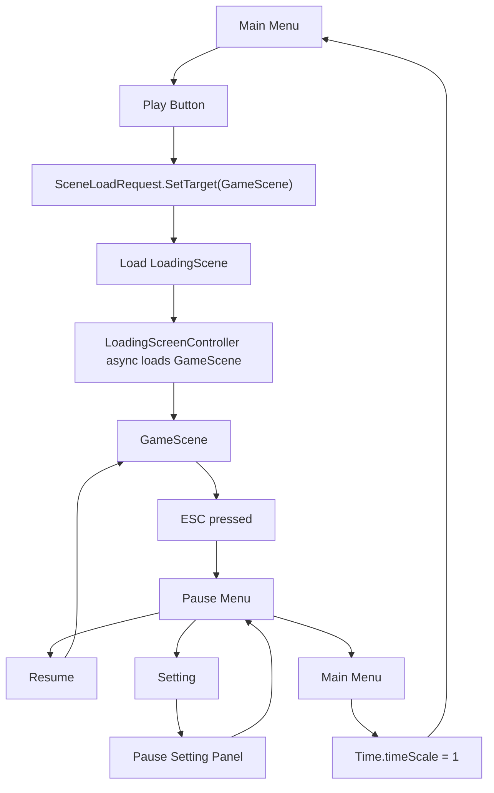

# ESC Pause and Loading Screen Technical Design Report

## Purpose

This report defines two UI flow systems for **Cure Me, Please**:

1. ESC Pause Game
2. Loading Screen before entering gameplay

The design follows the provided mockups:

- Pause menu overlay with `Resume`, `Setting`, and `Main Menu`.
- Pause setting panel with Music Volume and Game Volume sliders.
- Black loading screen with circular progress, percentage text, loading label, and horror tip text.

The goal is to add these systems without disrupting the current gameplay scene layout, authored sprites, camera positions, or treatment flow.

## Current Project Context

| Existing System | Current Role | How This Design Uses It |
| --- | --- | --- |
| `MainMenuController` | Controls Play, Setting, Quit, Credit, and scene loading from Main Menu. | Play should route through a Loading Scene before entering Game Scene. |
| `MenuAudioSettings` | Applies Music/Game volume through PlayerPrefs and AudioMixer parameters. | Pause Setting can reuse this component for in-game audio sliders. |
| `GameResultPanel` | Shows Win/Lose result and restores `Time.timeScale = 1f` before loading scenes. | Pause menu should follow the same safety rule before returning to Main Menu. |
| `BgmPlayer` | Scene-local BGM player added by the audio slice. | Loading and gameplay scenes may each own their own BGM behavior later. |
| `GameFlow` | Owns current gameplay state. | Pause should freeze gameplay without changing `GameFlow` state. |
| Input System package | Project uses the new Input System. | ESC input should use `Keyboard.current.escapeKey`, not legacy `Input.GetKeyDown`. |

## Design Goals

- Pressing ESC pauses and unpauses gameplay.
- Pause UI should work while time scale is zero.
- Pause should not break Sanity, Candle, RoomTransition, mini games, or active customer flow.
- Main Menu from Pause must restore `Time.timeScale = 1f`.
- Loading Scene should async-load target scenes and show progress.
- Loading Scene should be reusable for future transitions, not only Main Menu -> Game.
- Existing Main Menu settings logic should be reused instead of duplicating volume code.
- Missing UI references should fail safely during development.

## Out of Scope

The following items should not be part of the first implementation:

- Animated circular shader for loading progress.
- Save/load checkpoints.
- Pause animation polish.
- Controller/gamepad navigation.
- Screenshot blur or real grayscale post-processing.
- Persistent global scene transition manager.
- Loading from gameplay to ending scenes.

These can be added after the basic flow is stable.

## System 1: ESC Pause Game

### User Experience

During gameplay, the player presses ESC to open the pause overlay.

The background remains visible but darkened/desaturated, matching the mockup. The first pause panel shows:

```text
MENU
Resume
Setting
Main Menu
```

Pressing `Setting` switches to a second panel:

```text
Setting
Music Volume
Game Volume
Back
```

### Runtime Flow

```text
GameScene running
-> Player presses ESC
-> PauseRoot becomes active
-> PauseMenuPanel becomes active
-> PauseSettingPanel becomes inactive
-> Time.timeScale = 0

Pause menu active
-> Resume button or ESC
-> PauseRoot inactive
-> Time.timeScale = 1

Pause menu active
-> Setting button
-> PauseMenuPanel inactive
-> PauseSettingPanel active

Pause setting active
-> Back button or ESC
-> PauseSettingPanel inactive
-> PauseMenuPanel active

Pause menu active
-> Main Menu button
-> Time.timeScale = 1
-> Load MainMenuScene
```

### Proposed Script

```text
Assets/Core/Script/UI/PauseMenuController.cs
```

### Responsibilities

`PauseMenuController` should:

- Read ESC with the new Input System.
- Open and close pause UI.
- Switch between main pause panel and settings panel.
- Pause and resume `Time.timeScale`.
- Restore time scale before loading Main Menu.
- Optionally block pause if another blocking UI is open.

### Suggested Inspector Fields

```text
Panels
- GameObject root
- GameObject menuPanel
- GameObject settingsPanel

Buttons
- Button resumeButton
- Button settingsButton
- Button mainMenuButton
- Button backButton

Scenes
- string mainMenuSceneName = "MainMenuScene"

Rules
- bool canPause = true
- bool pauseOnEscape = true
- bool closeSettingsToMenuOnEscape = true
```

### Input Handling

Because the project uses the new Input System, ESC should be read through:

```csharp
Keyboard.current.escapeKey.wasPressedThisFrame
```

Avoid:

```csharp
Input.GetKeyDown(KeyCode.Escape)
```

Using legacy input can trigger runtime errors if the active input handling is set to Input System only.

### Time Scale Rules

When pause opens:

```csharp
Time.timeScale = 0f;
```

When pause closes:

```csharp
Time.timeScale = 1f;
```

When loading Main Menu:

```csharp
Time.timeScale = 1f;
SceneManager.LoadScene(mainMenuSceneName);
```

This is important because `Time.timeScale = 0f` can leak into the next scene if not restored.

### UI Hierarchy Recommendation

```text
PauseCanvas
- PauseRoot
  - DimOverlay
  - PauseMenuPanel
    - TitleText
    - ResumeButton
    - SettingButton
    - MainMenuButton
  - PauseSettingPanel
    - TitleText
    - MusicVolumeLabel
    - MusicSlider
    - GameVolumeLabel
    - GameSlider
    - BackButton
```

### Pause Setting Panel

The project already has `MenuAudioSettings`, so the Pause Setting panel should reuse it:

```text
PauseSettingPanel
- MenuAudioSettings
```

Assign:

- `musicSlider`
- `gameSlider`
- `audioMixer`
- `musicVolumeParameter = MusicVolume`
- `gameVolumeParameter = GameVolume`

This keeps Main Menu and Pause settings synchronized through PlayerPrefs.

### Interaction With Existing Systems

| System | Expected Pause Behavior |
| --- | --- |
| `Sanity` | Stops because it uses `Time.deltaTime`. |
| `Candle` | Stops if it uses scaled delta time. |
| Customer movement | Stops because movement uses `Time.deltaTime`. |
| Mini games | Stop because Update timing uses scaled delta time, unless a specific component uses unscaled time. |
| UI buttons | Continue working because Unity UI events are not blocked by time scale. |
| BGM/SFX | Continue unless AudioListener is paused. This design does not pause all audio globally. |

### Pause Blocking Rules

First implementation can be simple:

- ESC works whenever `canPause == true`.
- Result screen can manually disable or ignore pause later.

Recommended future option:

```csharp
public void SetCanPause(bool value)
```

This allows Win/Lose, cutscenes, or room transitions to block pause.

## System 2: Loading Screen Before Gameplay

### User Experience

When the player presses Play from Main Menu:

```text
MainMenuScene
-> LoadingScene
-> GameScene
```

The loading screen should show:

- Black background.
- Circular progress visual.
- Percentage text.
- "loading" label.
- A randomized tip, such as:

```text
Tip: Stay quiet. Some things can hear you.
```

### Why Use a Loading Scene

A separate Loading Scene is better than a Main Menu overlay because:

- It can be reused for other scene changes.
- It does not require the Main Menu canvas to survive across scene loads.
- It keeps async loading UI isolated.
- It avoids mixing Main Menu logic with gameplay loading logic.

### Proposed Scripts

```text
Assets/Core/Script/UI/SceneLoadRequest.cs
Assets/Core/Script/UI/LoadingScreenController.cs
```

### SceneLoadRequest

`SceneLoadRequest` should be a small static class that stores the target scene name.

Responsibilities:

- Store the target scene before loading `LoadingScene`.
- Provide a fallback scene name if none is set.
- Clear the request after the load begins or completes.

Suggested API:

```csharp
public static class SceneLoadRequest
{
    public static string TargetSceneName { get; private set; }

    public static void SetTarget(string sceneName);
    public static string ConsumeTarget(string fallbackSceneName);
}
```

### LoadingScreenController

Responsibilities:

- Read target scene from `SceneLoadRequest`.
- Start `SceneManager.LoadSceneAsync`.
- Display progress as 0-100%.
- Update loading ring fill amount if assigned.
- Display a random tip.
- Delay activation slightly so the loading screen is visible.
- Use realtime waits, not scaled time.

### Suggested Inspector Fields

```text
Scene
- string fallbackSceneName = "GameScene"
- float minimumLoadingTime = 0.75f
- bool activateWhenReady = true

UI
- TMP_Text progressText
- TMP_Text loadingText
- TMP_Text tipText
- Image progressRing

Tips
- string[] tips
```

### Async Loading Logic

Unity async scene load usually reports progress from 0 to 0.9 before activation.

Progress should be normalized:

```csharp
float normalizedProgress = Mathf.Clamp01(operation.progress / 0.9f);
```

Recommended flow:

```text
Awake/Start
-> Read target scene
-> Show random tip
-> Start LoadSceneAsync(target)
-> operation.allowSceneActivation = false
-> Update progress UI while operation.progress < 0.9
-> Wait until minimumLoadingTime is reached
-> Show 100%
-> operation.allowSceneActivation = true
```

### MainMenuController Change

Current behavior:

```csharp
SceneManager.LoadScene(gameSceneName);
```

Recommended behavior for Play:

```text
SceneLoadRequest.SetTarget(gameSceneName)
SceneManager.LoadScene(loadingSceneName)
```

Suggested fields:

```text
Scenes
- string gameSceneName = "GameScene"
- string loadingSceneName = "LoadingScene"
- string creditSceneName = "EndCedit"
- bool useLoadingSceneForPlay = true
```

Credit can still load directly for now.

### Loading UI Hierarchy Recommendation

```text
LoadingCanvas
- BlackBackground
- CenterGroup
  - ProgressRing
  - ProgressText
  - LoadingText
- TipText
```

### Tip List Examples

```text
Tip: Stay quiet. Some things can hear you.
Tip: The candle buys time, not safety.
Tip: A calm patient is easier to save.
Tip: Do not rush the blade.
Tip: If the room goes dark, finish what is in your hand first.
```

## Combined Flow



## Implementation Plan

### Step 1: Create Loading Request

Add:

```text
Assets/Core/Script/UI/SceneLoadRequest.cs
```

Acceptance:

- Any script can set a target scene.
- Loading Scene can consume the target.
- Empty target falls back safely.

### Step 2: Create Loading Screen Controller

Add:

```text
Assets/Core/Script/UI/LoadingScreenController.cs
```

Acceptance:

- Async load starts automatically.
- Progress percentage updates.
- Progress ring fill updates if assigned.
- Random tip appears.
- Scene activates when ready.

### Step 3: Update MainMenuController

Modify:

```text
Assets/Core/Script/MainMenu/MainMenuController.cs
```

Acceptance:

- Play can route through `LoadingScene`.
- Empty loading scene falls back to direct game scene load.
- Credit and Quit behavior remains unchanged.

### Step 4: Create Pause Menu Controller

Add:

```text
Assets/Core/Script/UI/PauseMenuController.cs
```

Acceptance:

- ESC opens pause menu.
- Resume closes pause menu.
- Setting opens setting panel.
- Back returns to pause menu.
- Main Menu restores time and loads menu scene.

### Step 5: Unity Setup

Set up scenes and UI objects manually to preserve current authored layout.

Do not move existing room sprites, camera positions, customer waypoints, candle, or door objects.

## Unity Setup Guide

### Loading Scene Setup

1. Create a scene named `LoadingScene`.
2. Add it to Build Settings.
3. Add `Canvas`.
4. Create:
   - `BlackBackground`
   - `ProgressRing`
   - `ProgressText`
   - `LoadingText`
   - `TipText`
5. Add `LoadingScreenController`.
6. Assign TMP texts and progress ring image.
7. Set fallback scene to `GameScene`.
8. Add tip strings.

### Main Menu Setup

1. Select the object with `MainMenuController`.
2. Set:
   - `Game Scene Name = GameScene`
   - `Loading Scene Name = LoadingScene`
   - `Use Loading Scene For Play = true`
3. Confirm `LoadingScene` and `GameScene` are in Build Settings.

### Pause Menu Setup

1. In `GameScene`, create `PauseCanvas`.
2. Add `PauseRoot`.
3. Add dark overlay matching the mockup.
4. Add `PauseMenuPanel`.
5. Add `PauseSettingPanel`.
6. Add `PauseMenuController`.
7. Assign:
   - Root
   - Menu Panel
   - Setting Panel
   - Resume Button
   - Setting Button
   - Main Menu Button
   - Back Button
8. Keep `PauseRoot` inactive by default.

### Pause Audio Setting Setup

1. Add `MenuAudioSettings` to the Pause Setting panel or a child object.
2. Assign:
   - Music Slider
   - Game Slider
   - AudioMixer
3. Confirm exposed parameters:
   - `MusicVolume`
   - `GameVolume`

## Test Checklist

### Loading Screen

- Pressing Play from Main Menu opens `LoadingScene`.
- Loading screen displays a tip.
- Progress text reaches 100%.
- GameScene activates after loading.
- If `LoadingScene` name is empty, Play loads GameScene directly.
- If target scene is empty, LoadingScene falls back to `GameScene`.

### Pause Menu

- ESC opens pause menu.
- ESC closes pause menu from the main pause panel.
- ESC returns from setting panel to main pause panel.
- Resume button closes pause menu.
- Setting button opens setting panel.
- Back button returns to pause menu.
- Main Menu button loads MainMenuScene.
- `Time.timeScale` is 0 while paused.
- `Time.timeScale` returns to 1 after resume.
- `Time.timeScale` returns to 1 before Main Menu loads.

### Audio Settings

- Music slider updates mixer volume.
- Game slider updates mixer volume.
- Slider values persist through PlayerPrefs.
- Pause settings and Main Menu settings use the same saved values.

### Regression

- Win/Lose panel still works.
- Room transition still works.
- Candle/Sanity resume normally after pause.
- Mini games do not continue progressing while paused.

## Risk Notes

| Risk | Mitigation |
| --- | --- |
| `Time.timeScale` remains 0 after loading Main Menu | Always set `Time.timeScale = 1f` before scene loads. |
| ESC input fails under Input System only mode | Use `UnityEngine.InputSystem.Keyboard`, not legacy input. |
| Pause opens during result screen | Add `SetCanPause(false)` later from result flow if needed. |
| Loading Scene cannot find target | Use fallback scene name. |
| Progress appears stuck at 90% | Normalize `operation.progress / 0.9f`. |
| Main Menu settings and Pause settings desync | Reuse `MenuAudioSettings` and PlayerPrefs keys. |

## Recommended First Implementation Scope

Implement only:

- `SceneLoadRequest`
- `LoadingScreenController`
- MainMenu Play routing through LoadingScene
- `PauseMenuController`

Do not create automatic editor setup tools yet. The UI layout is mockup-driven and should be assembled manually in Unity first so the visual design can be tuned by hand.

## Future Extensions

- Animated loading ring.
- Randomized loading background images.
- Scene-specific tip categories.
- Pause menu button hover animation.
- Confirm dialog before returning to Main Menu.
- Pause blocked during room transition.
- Global scene transition service for all scene loads.
- Controller navigation.

## Summary

The ESC Pause system should freeze gameplay cleanly while keeping UI and settings usable. The Loading Screen should become the standard bridge from Main Menu into GameScene, giving the player feedback before the game starts. Both systems should stay small, inspector-driven, and compatible with the existing `MainMenuController`, `MenuAudioSettings`, and Win/Lose scene loading safety rules.
